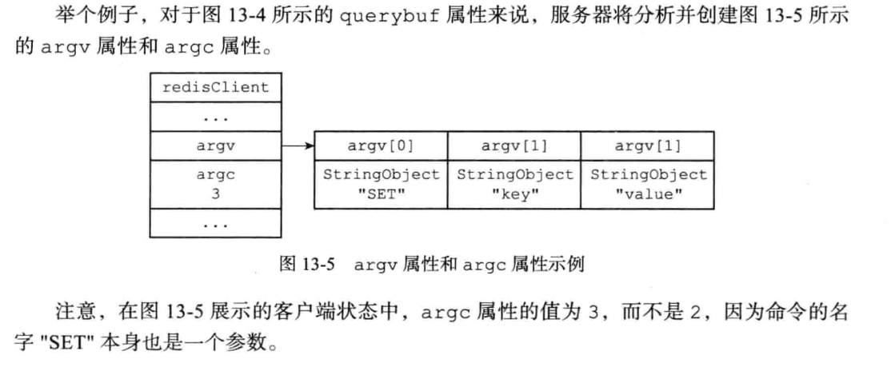
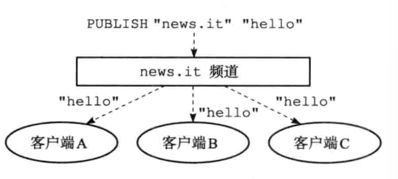

目前源码分析基于redis 7.0


# 数据结构与对象

## 简单动态字符串

### 介绍

Redis没有直接使用C语言传统的字符串表示(以空字符结尾的字符数组，以下简称C字符串 )，而是自己构建了一种名为简单动态字符串(simple dynamic string，SDs)的抽象类型，并将SDS 用作Redis的默认字符串表示。

在Redis里面，C字符串只会作为字符串字面量(string literal)用在一些无须对字符串值进行修改的地方，比如打印日志。

当Redis需要的不仅仅是一个字符串字面量，而是一个可以被修改的字符串值时，Redis就会使用SDS来表示字符串值，比如在Redis的数据库里面，包含字符串值的键值对在底层都是由SDS实现的。

举个例子：

`redis> SET msg "hello world"`

键值对的键是一个字符串对象，对象的底层实现是一个保存着字符串"msg"的 SDS。键值对的值也是一个字符串对象，对象的底层实现是一个保存着字符串"hello world"的SDS.


### SDS的定义

```cpp
// src/sds.h
typedef char *sds;
/* __packed__ 取消结构在编译过程中的优化对齐，按照实际占用字节数进行内存分配
 * SDS 数据结构定义：<len><alloc><flags><buf>
 * 特性1：sds 指针是直接指向 buf 字节数组，使得 SDS 可以直接使用 C 语言 string.h 库中的函数
 * 特性2：并且根据 buf 前进一位就能直接获取 flags，从而快速拿到类型，例如 `unsigned char flags = s[-1]`
 * */

/* Note: sdshdr5 is never used, we just access the flags byte directly.
 * However is here to document the layout of type 5 SDS strings. */
/*lsb Least Significant Bits: 只需要三位就可以概括所有的类型 编号分别是0 1 2 3 4*/
struct __attribute__ ((__packed__)) sdshdr5 {
    unsigned char flags; /* 3 lsb of type, and 5 msb of string length */
    char buf[];
};
struct __attribute__ ((__packed__)) sdshdr8 {
    uint8_t len; /* used */
    uint8_t alloc; /* excluding the header and null terminator */
    unsigned char flags; /* 3 lsb of type, 5 unused bits */
    char buf[];
};
struct __attribute__ ((__packed__)) sdshdr16 {
    uint16_t len; /* used */
    uint16_t alloc; /* excluding the header and null terminator */
    unsigned char flags; /* 3 lsb of type, 5 unused bits */
    char buf[];
};
struct __attribute__ ((__packed__)) sdshdr32 {
    uint32_t len; /* used */
    uint32_t alloc; /* excluding the header and null terminator */
    unsigned char flags; /* 3 lsb of type, 5 unused bits */
    char buf[];
};
struct __attribute__ ((__packed__)) sdshdr64 {
    uint64_t len; /* used */
    uint64_t alloc; /* excluding the header and null terminator */
    unsigned char flags; /* 3 lsb of type, 5 unused bits */
    char buf[];
};

#define SDS_TYPE_5  0
#define SDS_TYPE_8  1
#define SDS_TYPE_16 2
#define SDS_TYPE_32 3
#define SDS_TYPE_64 4
#define SDS_TYPE_MASK 7 /* 0b0111 三位最低有效位的 SDS 类型掩码 */
#define SDS_TYPE_BITS 3
/* 获取指向 SDS 头部的指针并将其复制给相应 SDS 类型的指针变量 sh */
#define SDS_HDR_VAR(T,s) struct sdshdr##T *sh = (void*)((s)-(sizeof(struct sdshdr##T)));
/* HDR header 这个宏的作用是获取SDS的头部的指针 */
#define SDS_HDR(T,s) ((struct sdshdr##T *)((s)-(sizeof(struct sdshdr##T))))
#define SDS_TYPE_5_LEN(f) ((f)>>SDS_TYPE_BITS)

/* 获取 SDS 的长度 */
static inline size_t sdslen(const sds s) {
    unsigned char flags = s[-1]; /* 根据 sds 数据结构的定义，sds 的指针是指向 buf,前一个字节就是 flags，用作类型判断 */
    switch(flags&SDS_TYPE_MASK) { /* & 0b0111 取出3位低有效位中的类型 */
        case SDS_TYPE_5:
            return SDS_TYPE_5_LEN(flags);
        case SDS_TYPE_8:
            return SDS_HDR(8,s)->len;
        case SDS_TYPE_16:
            return SDS_HDR(16,s)->len;
        case SDS_TYPE_32:
            return SDS_HDR(32,s)->len;
        case SDS_TYPE_64:
            return SDS_HDR(64,s)->len;
    }
    return 0;
}
```

sds本质上就是字符指针，这样设计就可以直接用c的printf函数。sdshdr其实加上一些额外的内存，方便快速访问。为了获取sdshdr的信息，我们定义一些宏，来获得sdshdr的指针。


zmalloc

``` cpp
zmalloc.c
/*
 * redis 为了知晓某个指针被分配的空间, 会在申请空间给指针 ptr 时, 额外给 ptr 申请 sizeof(size_t) 大小的空间
 * 假设现在需要给 ptr 分配 size 大小
 * 那么 ptr 被分配的内存大概长这个样子 ==> [ header ] [ data ], 其中 header 占 sizeof(size_t) 大小, 这部分空间存储一个类型为 size_t 的数为 size
 * 而 data 占 size 的大小, 这部分才是真正会被用户用到的空间. 所以我们返回指针时, 实际应该返回 (char*)ptr+sizeof(size_t)
 */
void *zmalloc(size_t size) {
	
    /* 按 redis 的策略分配空间 */
    void *ptr = ztrymalloc_usable(size, NULL);
	
    /*  分配不成功, 打印错误信息并退出 redis-server.　*/
    if (!ptr) zmalloc_oom_handler(size);
    return ptr;
}
/*
 * 尝试分配空间, 如果分配失败返回 NULL.
 * 如果分配成功, 还会把 *usable 设置为可用空间的大小.
 *
 * ( 建议先看 zmalloc 函数的注释 )
 * 首先分配一个 size + sizeof(size_t) 大小的空间
 * 然后判断宏 HAVE_MALLOC_SIZE 是否存在, 也就是是否存在 zmalloc_size 函数, 然后进行具体逻辑.
 */
void *ztrymalloc_usable(size_t size, size_t *usable) {
    ASSERT_NO_SIZE_OVERFLOW(size);
    void *ptr = malloc(MALLOC_MIN_SIZE(size)+PREFIX_SIZE);

    if (!ptr) return NULL;
	
/* 存在 zmalloc_size 函数, 可以直接调函数获取实际 malloc 分配的空间 */
#ifdef HAVE_MALLOC_SIZE
    size = zmalloc_size(ptr);
	
    /* 原子操作,修改 redis 总共使用的空间. */
    update_zmalloc_stat_alloc(size);
    if (usable) *usable = size;
    return ptr;
	
/* 不存在 zmalloc_size 函数, 必须手动给起始的 sizeof(size_t) 字节赋值为数字 size (作为分配了多少可用空间的标识) */
#else
    *((size_t*)ptr) = size;
    update_zmalloc_stat_alloc(size+PREFIX_SIZE);//原子操作 ，记录内存的使用大小
    if (usable) *usable = size;
    return (char*)ptr+PREFIX_SIZE;
#endif
}
```

zfree

```cpp
void zfree(void *ptr) {
#ifndef HAVE_MALLOC_SIZE
    void *realptr;
    size_t oldsize;
#endif

    if (ptr == NULL) return;
#ifdef HAVE_MALLOC_SIZE
    update_zmalloc_stat_free(zmalloc_size(ptr));
    free(ptr);
#else
    realptr = (char*)ptr-PREFIX_SIZE;
    oldsize = *((size_t*)realptr);
    update_zmalloc_stat_free(oldsize+PREFIX_SIZE);
    free(realptr);
#endif
}
```

strcat封装了memcpy，根据可用空间大小，动态扩容。核心是调用了以下函数

```cpp
sds _sdsMakeRoomFor(sds s, size_t addlen, int greedy)
```


## 字典


```cpp
typedef struct dictEntry {
    /* void * 类型的 key，可以指向任意类型的键 */
    void *key;
    /* 联合体 v 中包含了指向实际值的指针 *val、无符号的 64 位整数、有符号的 64 位整数，以及 double 双精度浮点数。
     * 这是一种节省内存的方式，因为当值为整数或者双精度浮点数时，由于它们本身就是 64 位的，void *val 指针也是占用 64 位（64 操作系统下），
     * 所以它们可以直接存在键值对的结构体中，避免再使用一个指针，从而节省内存开销（8 个字节）
     * 当然也可以是 void *，存储任何类型的数据，最早 redis1.0 版本就只是 void* */
    union {
        void *val;
        uint64_t u64;
        int64_t s64;
        double d;
    } v;
    struct dictEntry *next;     /* Next entry in the same hash bucket. */
                                /* 同一个 hash 桶中的下一个条目.
                                 * 通过形成一个链表解决桶内的哈希冲突. */
    void *metadata[];           /* An arbitrary number of bytes (starting at a
                                 * pointer-aligned address) of size as returned
                                 * by dictType's dictEntryMetadataBytes(). */
                                /* 一块任意长度的数据 (按 void* 的大小对齐),
                                 * 具体长度由 'dictType' 中的
                                 * dictEntryMetadataBytes() 返回. */
} dictEntry;
/* 字典类型，因为我们会将字典用在各个地方，例如键空间、过期字典等等等，只要是想用字典（哈希表）的场景都可以用
 * 这样的话每种类型的字典，它对应的 key / value 肯定类型是不一致的，这就需要有一些自定义的方法，例如键值对复制、析构等 */
typedef struct dictType {
    /* 字典里哈希表的哈希算法，目前使用的是基于 DJB 实现的字符串哈希算法
     * 比较出名的有 siphash，redis 4.0 中引进了它。3.0 之前使用的是 DJBX33A，3.0 - 4.0 使用的是 MurmurHash2 */
    uint64_t (*hashFunction)(const void *key);
    /* 键拷贝 */
    void *(*keyDup)(dict *d, const void *key);
    /* 值拷贝 */
    void *(*valDup)(dict *d, const void *obj);
    /* 键比较 */
    int (*keyCompare)(dict *d, const void *key1, const void *key2);
    /* 键析构 */
    void (*keyDestructor)(dict *d, void *key);
    /* 值析构 */
    void (*valDestructor)(dict *d, void *obj);
    /* 字典里的哈希表是否允许扩容 */
    int (*expandAllowed)(size_t moreMem, double usedRatio);
    /* Allow a dictEntry to carry extra caller-defined metadata.  The
     * extra memory is initialized to 0 when a dictEntry is allocated. */
    /* 允许调用者向条目 (dictEntry) 中添加额外的元信息.
     * 这段额外信息的内存会在条目分配时被零初始化. */
    size_t (*dictEntryMetadataBytes)(dict *d);
} dictType;


/* 通过指数计算哈希表的大小，见下面 exp，哈希表大小目前是严格的 2 的幂 */
#define DICTHT_SIZE(exp) ((exp) == -1 ? 0 : (unsigned long)1<<(exp))
/* 计算掩码，哈希表的长度 - 1，用于计算键在哈希表中的位置（下标索引） */
#define DICTHT_SIZE_MASK(exp) ((exp) == -1 ? 0 : (DICTHT_SIZE(exp))-1)


struct dict {
    /* 字典类型，8 bytes */
    dictType *type;
    /* 字典中使用了两个哈希表,
     * (看看那些以 'ht_' 为前缀的成员, 它们都是一个长度为 2 的数组)
     *
     * 我们可以将它们视为
     * struct{
     *   ht_table[2];
     *   ht_used[2];
     *   ht_size_exp[2];
     * } hash_table[2];
     * 为了优化字典的内存结构,
     * 减少对齐产生的空洞,
     * 我们将这些数据分散于整个结构体中.
     *
     * 平时只使用下标为 0 的哈希表.
     * 当需要进行 rehash 时 ('rehashidx' != -1),
     * 下标为 1 的一组数据会作为一组新的哈希表,
     * 渐进地进行 rehash 避免一次性 rehash 造成长时间的阻塞.
     * 当 rehash 完成时, 将新的哈希表置入下标为 0 的组别中,
     * 同时将 'rehashidx' 置为 -1.
     */
    dictEntry **ht_table[2];
    /* 哈希表存储的键数量，它与哈希表的大小 size 的比值就是 load factor 负载因子，
     * 值越大说明哈希碰撞的可能性也越大，字典的平均查找效率也越低
     * 理论上负载因子 <=1 的时候，字典能保持平均 O(1) 的时间复杂度查询
     * 当负载因子等于哈希表大小的时候，说明哈希表退化成链表了，此时查询的时间复杂度退化为 O(N)
     * redis 会监控字典的负载因子，在负载因子变大的时候，会对哈希表进行扩容，后面会提到的渐进式 rehash */
    unsigned long ht_used[2];

    long rehashidx; /* rehashing not in progress if rehashidx == -1 */
                    /* rehash 的进度.
                     * 如果此变量值为 -1, 则当前未进行 rehash. */
    /* Keep small vars at end for optimal (minimal) struct padding */
    /* 将小尺寸的变量置于结构体的尾部, 减少对齐产生的额外空间开销. */
    int16_t pauserehash; /* If >0 rehashing is paused (<0 indicates coding error) */
                         /* 如果此变量值 >0 表示 rehash 暂停
                          * (<0 表示编写的代码出错了). */
    /* 存储哈希表大小的指数表示，通过这个可以直接计算出哈希表的大小，例如 exp = 10, size = 2 ** 10
     * 能避免说直接存储 size 的实际值，以前 8 字节存储的数值现在变成 1 字节进行存储 */
    signed char ht_size_exp[2]; /* exponent of size. (size = 1<<exp) */
                                /* 哈希表大小的指数表示.
                                 * (以 2 为底, 大小 = 1 << 指数) */
};

typedef struct dictIterator {
    dict *d;
    /* hash 字典中 bucket 的索引，使用方法：d->ht_table[0/1][index] */
    long index;
    int table, safe;
    dictEntry *entry, *nextEntry;
    /* unsafe iterator fingerprint for misuse detection. */
    /* 指纹, 用于检查不安全迭代器的误用. */
    unsigned long long fingerprint;
} dictIterator;
```

TODO:

dictEntry **ht_table[2]; 画图


添加

```cpp
/* Add an element to the target hash table */
/* 向字典（哈希表）中添加元素 */
int dictAdd(dict *d, void *key, void *val)
{
    dictEntry *entry = dictAddRaw(d,key,NULL);

    if (!entry) return DICT_ERR;
    dictSetVal(d, entry, val);
    return DICT_OK;
}

/* Low level add or find:
 * This function adds the entry but instead of setting a value returns the
 * dictEntry structure to the user, that will make sure to fill the value
 * field as they wish.
 *
 * This function is also directly exposed to the user API to be called
 * mainly in order to store non-pointers inside the hash value, example:
 *
 * entry = dictAddRaw(dict,mykey,NULL);
 * if (entry != NULL) dictSetSignedIntegerVal(entry,1000);
 *
 * Return values:
 *
 * If key already exists NULL is returned, and "*existing" is populated
 * with the existing entry if existing is not NULL.
 *
 * If key was added, the hash entry is returned to be manipulated by the caller.
 */
/* 此方法用与对所给定的 key ，在哈希表中添加一个实体（entry）
 * 此方法不会直接向实体中添加 value。相反，它会把该实体返回给调用者，让调用者按照自己的意愿来对这个实体进行操作
 *
 * 例子：
 * entry = dictAddRaw(dict,mykey,NULL);
 * if (entry != NULL) dictSetSignedIntegerVal(entry,1000);
 *
 * 假如 给定的 key 已经在哈希表中存在，则返回 NULL 并且将此 key 对应的实体赋值给 *existing
 * */
dictEntry *dictAddRaw(dict *d, void *key, dictEntry **existing)
{
    long index;
    dictEntry *entry;
    int htidx;

    if (dictIsRehashing(d)) _dictRehashStep(d);

    /* Get the index of the new element, or -1 if
     * the element already exists. */
    if ((index = _dictKeyIndex(d, key, dictHashKey(d,key), existing)) == -1)
        return NULL;

    /* Allocate the memory and store the new entry.
     * Insert the element in top, with the assumption that in a database
     * system it is more likely that recently added entries are accessed
     * more frequently. */
    /* 如果哈希表处在重哈希状态，则对新表（ht_table[1]）进行操作 */
    htidx = dictIsRehashing(d) ? 1 : 0;
    size_t metasize = dictMetadataSize(d);
    entry = zmalloc(sizeof(*entry) + metasize);
    if (metasize > 0) {
        memset(dictMetadata(entry), 0, metasize);
    }
    /* 头插法，假设最近加入的entry有更大概率被访问 */
    entry->next = d->ht_table[htidx][index];
    d->ht_table[htidx][index] = entry;
    d->ht_used[htidx]++;

    /* Set the hash entry fields. */
    dictSetKey(d, entry, key);
    return entry;
}
```


删除

```cpp
/* Search and remove an element. This is a helper function for
 * dictDelete() and dictUnlink(), please check the top comment
 * of those functions. */
/* 此方法是 dictDelete() 和 dictUnlink() 的辅助方法
 * 值的注意的点是该方法接收的参数 nofree
 * 当 nofree = 1 时，该方法不会释放被 unlinked 的实体的内存，并且会把这个实体返回 */
static dictEntry *dictGenericDelete(dict *d, const void *key, int nofree) {
    uint64_t h, idx;
    dictEntry *he, *prevHe;
    int table;

    /* dict is empty */
    if (dictSize(d) == 0) return NULL;

    if (dictIsRehashing(d)) _dictRehashStep(d);
    h = dictHashKey(d, key);

    for (table = 0; table <= 1; table++) {
        idx = h & DICTHT_SIZE_MASK(d->ht_size_exp[table]);
        he = d->ht_table[table][idx];
        prevHe = NULL;
        while(he) {
            if (key==he->key || dictCompareKeys(d, key, he->key)) {
                /* Unlink the element from the list */
                if (prevHe)
                    prevHe->next = he->next;
                else
                    d->ht_table[table][idx] = he->next;
                if (!nofree) {
                    dictFreeUnlinkedEntry(d, he);
                }
                d->ht_used[table]--;
                return he;
            }
            prevHe = he;
            he = he->next;
        }
        if (!dictIsRehashing(d)) break;
    }
    return NULL; /* not found */
}
```


## 对象

在前面，我们陆续介绍了Redis用到的所有主要数据结构，简单动态字符串(SDS)和字典。除此之外redis还有双端链表、压缩列表、整数集合等等。

Redis 并没有直接使用这些数据结构来实现键值对数据库，而是基于这些数据结构创建了一个对象系统，这个系统包含字符串对象、列表对象、哈希对象、集合对象和有序集合对象这五种类型的对象，每种对象都用到了至少一种我们前面所介绍的数据结构。

通过这五种不同类型的对象，Redis可以在执行命令之前，根据对象的类型来判断一个对象是否可以执行给定的命令。使用对象的另一个好处是，我们可以针对不同的使用场景为对象设置多种不同的数据结构实现，从而优化对象在不同场景下的使用效率。

除此之外，Redis的对象系统还实现了基于引用计数技术的内存回收机制，当程序不再使用某个对象的时候，这个对象所占用的内存就会被自动释放:另外，Redis还通过引用计数技术实现了对象共享机制，这一机制可以在适当的条件下，通过让多个数据库键共享同一个对象来节约内存。

最后，Redis的对象带有访问时间记录信息，该信息可以用于计算数据库键的空转时长，在服务器启用了maxmemory功能的情况下，空转时长较大的那些键可能会优先被服务器删除。

接下来我们将逐一介绍以上提到的Redis对象系统的各个特性。


### 对象的类型与编码

src/server.h

Redis使用对象来表示数据库中的键和值，每次当我们在Redis的数据库中新创建一个键值对时，我们至少会创建两个对象，一个对象用作键值对的键(键对象)，另一个对象用作键值对的值(值对象)。

```cpp
typedef struct redisObject {
    unsigned type:4;  /* 对象的类型，包含字符串对象、列表对象、哈希对象、
                       * 集合对象、有序集合对象等 */
    unsigned encoding:4;   /* 编码方式，表示 ptr 指向的数据类型的具体数据结构，
                            * 即这个对象使用了什么数据结构作为底层保存数据。
                            * 同一个对象使用不同编码实现，其内存占用存在明显差异，
                            * 内部编码对内存优化非常重要。 */
    unsigned lru:LRU_BITS; /* LRU time (relative to global lru_clock) or
                            * LFU data (least significant 8 bits frequency
                            * and most significant 16 bits access time). */
                          /* 需要根据不同的淘汰算法来决定，如果使用LRU,那么就是
                           * 对象最后一次被访问的时间，(和全局lru_clock相关)，
                           * 或者LFU数据(最低8位表示访问频率，
                           * 同时最高16位表示访问时间) */
    int refcount; /* 表示引用计数，由于 C 语言并不具备内存回收功能，Redis 在
                   * 自己的对象系统中添加了这个属性，当一个对象的引用计数为0时，
                   * 表示该对象已经不被任何对象引用，可以进行垃圾回收了。 */
    void *ptr; /* 对象的指针，指向实际存储对象数据。根据对象的类型和编码不同，
                * ptr 可能指向 String、Lists、Hashes 等具体的数据结构, */
} robj;
```

### 对象的类型

```cpp
/* 实际的 Redis 对象 */
#define OBJ_STRING 0    /* String object. */
#define OBJ_LIST 1      /* List object. */
#define OBJ_SET 2       /* Set object. */
#define OBJ_ZSET 3      /* Sorted set object. */
#define OBJ_HASH 4      /* Hash object. */
```

### 编码

```cpp
/* Objects encoding. Some kind of objects like Strings and Hashes can be
 * internally represented in multiple ways. The 'encoding' field of the object
 * is set to one of this fields for this object. */
#define OBJ_ENCODING_RAW 0     /* Raw representation */
#define OBJ_ENCODING_INT 1     /* Encoded as integer */
#define OBJ_ENCODING_HT 2      /* Encoded as hash table */
#define OBJ_ENCODING_ZIPMAP 3  /* No longer used: old hash encoding. */
#define OBJ_ENCODING_LINKEDLIST 4 /* No longer used: old list encoding. */
#define OBJ_ENCODING_ZIPLIST 5 /* No longer used: old list/hash/zset encoding. */
#define OBJ_ENCODING_INTSET 6  /* Encoded as intset */
#define OBJ_ENCODING_SKIPLIST 7  /* Encoded as skiplist */
#define OBJ_ENCODING_EMBSTR 8  /* Embedded sds string encoding */
#define OBJ_ENCODING_QUICKLIST 9 /* Encoded as linked list of listpacks */
#define OBJ_ENCODING_STREAM 10 /* Encoded as a radix tree of listpacks */
#define OBJ_ENCODING_LISTPACK 11 /* Encoded as a listpack */
```


通过encoding属性来设定对象所使用的编码，而不是为特定类型的对象关联一种固定的编码，极大地提升了Redis的灵活性和效率，因为Redis可以根据不同的使用场景来为一个对象设置不同的编码，从而优化对象在某一场景下的效率。

举个例子，在列表对象包含的元素比较少时，Redis 使用压缩列表作为列表对象的底层实现:

- 因为压缩列表比双端链表更节约内存，并且在元素数量较少时，在内存中以连续块方式保存的压缩列表比起双端链表可以更快被载入到缓存中;
- 随着列表对象包含的元素越来越多，使用压缩列表来保存元素的优势逐渐消失时，对象就会将底层实现从压缩列表转向功能更强、也更适合保存大量元素的双端链表上面;

其他类型的对象也会通过使用多种不同的编码来进行类似的优化。


因为C语言并不具备自动内存回收功能，所以Redis在自己的对象系统中构建了一个引用计数(reference counting)技术实现的内存回收机制，通过这一机制，程序可以通过跟踪对象的引用计数信息，在适当的时候自动释放对象并进行内存回收。

对象的引用计数信息会随着对象的使用状态而不断变化:

- 在创建一个新对象时，引用计数的值会被初始化为1;
- 当对象被一个新程序使用时，它的引用计数值会被增一;
- 当对象不再被一个程序使用时，它的引用计数值会被减一
- 当对象的引用计数值变为0时，对象所占用的内存会被释放。


# 单机服务器

## 客户端

src/server.h

Redis服务器是典型的一对多服务器程序:一个服务器可以与多个客户端建立网络连接每个客户端可以向服务器发送命令请求，而服务器则接收并处理客户端发送的命令请求，并向客户端返回命令回复。


```cpp
typedef struct client {
    uint64_t id;            /* Client incremental unique ID. */
    uint64_t flags;         /* Client flags: CLIENT_* macros. */
    connection *conn;
    int resp;               /* RESP protocol version. Can be 2 or 3. */
    redisDb *db;            /* Pointer to currently SELECTed DB. */
    robj *name;             /* As set by CLIENT SETNAME. */
    sds querybuf;           /* Buffer we use to accumulate client queries. */
    size_t qb_pos;          /* The position we have read in querybuf. */
    size_t querybuf_peak;   /* Recent (100ms or more) peak of querybuf size. */
    int argc;               /* Num of arguments of current command. */
    robj **argv;            /* Arguments of current command. */
    int argv_len;           /* Size of argv array (may be more than argc) */
    int original_argc;      /* Num of arguments of original command if arguments were rewritten. */
    robj **original_argv;   /* Arguments of original command if arguments were rewritten. */
    size_t argv_len_sum;    /* Sum of lengths of objects in argv list. */
    struct redisCommand *cmd, *lastcmd;  /* Last command executed. */
    struct redisCommand *realcmd; /* The original command that was executed by the client,
                                     Used to update error stats in case the c->cmd was modified
                                     during the command invocation (like on GEOADD for example). */
    user *user;             /* User associated with this connection. If the
                               user is set to NULL the connection can do
                               anything (admin). */
    int reqtype;            /* Request protocol type: PROTO_REQ_* */
    int multibulklen;       /* Number of multi bulk arguments left to read. */
    long bulklen;           /* Length of bulk argument in multi bulk request. */
    list *reply;            /* List of reply objects to send to the client. */
    unsigned long long reply_bytes; /* Tot bytes of objects in reply list. */
    list *deferred_reply_errors;    /* Used for module thread safe contexts. */
    size_t sentlen;         /* Amount of bytes already sent in the current
                               buffer or object being sent. */
    time_t ctime;           /* Client creation time. */
    long duration;          /* Current command duration. Used for measuring latency of blocking/non-blocking cmds */
    int slot;               /* The slot the client is executing against. Set to -1 if no slot is being used */
    time_t lastinteraction; /* Time of the last interaction, used for timeout */
    time_t obuf_soft_limit_reached_time;
    int authenticated;      /* Needed when the default user requires auth. */
    int replstate;          /* Replication state if this is a slave. */
    int repl_start_cmd_stream_on_ack; /* Install slave write handler on first ACK. */
    int repldbfd;           /* Replication DB file descriptor. */
    off_t repldboff;        /* Replication DB file offset. */
    off_t repldbsize;       /* Replication DB file size. */
    sds replpreamble;       /* Replication DB preamble. */
    long long read_reploff; /* Read replication offset if this is a master. */
    long long reploff;      /* Applied replication offset if this is a master. */
    long long repl_applied; /* Applied replication data count in querybuf, if this is a replica. */
    long long repl_ack_off; /* Replication ack offset, if this is a slave. */
    long long repl_ack_time;/* Replication ack time, if this is a slave. */
    long long repl_last_partial_write; /* The last time the server did a partial write from the RDB child pipe to this replica  */
    long long psync_initial_offset; /* FULLRESYNC reply offset other slaves
                                       copying this slave output buffer
                                       should use. */
    char replid[CONFIG_RUN_ID_SIZE+1]; /* Master replication ID (if master). */
    int slave_listening_port; /* As configured with: REPLCONF listening-port */
    char *slave_addr;       /* Optionally given by REPLCONF ip-address */
    int slave_capa;         /* Slave capabilities: SLAVE_CAPA_* bitwise OR. */
    int slave_req;          /* Slave requirements: SLAVE_REQ_* */
    multiState mstate;      /* MULTI/EXEC state */
    int btype;              /* Type of blocking op if CLIENT_BLOCKED. */
    blockingState bpop;     /* blocking state */
    long long woff;         /* Last write global replication offset. */
    list *watched_keys;     /* Keys WATCHED for MULTI/EXEC CAS */
    dict *pubsub_channels;  /* channels a client is interested in (SUBSCRIBE) */
    list *pubsub_patterns;  /* patterns a client is interested in (SUBSCRIBE) */
    dict *pubsubshard_channels;  /* shard level channels a client is interested in (SSUBSCRIBE) */
    sds peerid;             /* Cached peer ID. */
    sds sockname;           /* Cached connection target address. */
    listNode *client_list_node; /* list node in client list */
    listNode *postponed_list_node; /* list node within the postponed list */
    listNode *pending_read_list_node; /* list node in clients pending read list */
    RedisModuleUserChangedFunc auth_callback; /* Module callback to execute
                                               * when the authenticated user
                                               * changes. */
    void *auth_callback_privdata; /* Private data that is passed when the auth
                                   * changed callback is executed. Opaque for
                                   * Redis Core. */
    void *auth_module;      /* The module that owns the callback, which is used
                             * to disconnect the client if the module is
                             * unloaded for cleanup. Opaque for Redis Core.*/

    /* If this client is in tracking mode and this field is non zero,
     * invalidation messages for keys fetched by this client will be send to
     * the specified client ID. */
    uint64_t client_tracking_redirection;
    rax *client_tracking_prefixes; /* A dictionary of prefixes we are already
                                      subscribed to in BCAST mode, in the
                                      context of client side caching. */
    /* In updateClientMemUsage() we track the memory usage of
     * each client and add it to the sum of all the clients of a given type,
     * however we need to remember what was the old contribution of each
     * client, and in which category the client was, in order to remove it
     * before adding it the new value. */
    size_t last_memory_usage;
    int last_memory_type;

    listNode *mem_usage_bucket_node;
    clientMemUsageBucket *mem_usage_bucket;

    listNode *ref_repl_buf_node; /* Referenced node of replication buffer blocks,
                                  * see the definition of replBufBlock. */
    size_t ref_block_pos;        /* Access position of referenced buffer block,
                                  * i.e. the next offset to send. */

    /* Response buffer */
    size_t buf_peak; /* Peak used size of buffer in last 5 sec interval. */
    mstime_t buf_peak_last_reset_time; /* keeps the last time the buffer peak value was reset */
    int bufpos;
    size_t buf_usable_size; /* Usable size of buffer. */
    char *buf;
} client;
```


### 输入缓冲区

`querybuf`用于保存客户端发送的命令请求。

假设发送了这个命令`set key value`

那么缓冲区里面存的就是`3\r\n$3\r\nSET\r\n$3\r\nkey\r\n$5\r\nvalue\r\n`

这种是Redis 协议（也称为 RESP - Redis Serialization Protocol）的一部分，用于在客户端和 Redis 服务器之间传输命令和数据。RESP 协议是一种简单的、易于实现的协议，它支持多种数据类型，包括整数、字符串、数组等。

- `*3\r\n`：这是一个数组的长度前缀，表示接下来将有三个参数。`\r\n` 是回车加换行符，用于分隔不同的部分。
- `$3\r\n`：这是第一个参数的长度前缀，表示接下来的字符串（即 `SET` 命令）有 3 个字节长。
- `SET\r\n`：这是实际的 `SET` 命令字符串。
- `$3\r\n`：这是第二个参数的长度前缀，表示接下来的键（`key`）有 3 个字节长。
- `key\r\n`：这是实际的键字符串。
- `$5\r\n`：这是第三个参数的长度前缀，表示接下来的值（`value`）有 5 个字节长。
- `value\r\n`：这是实际的值字符串。


### 命令与命令参数

```cpp
    int argc;               /* Num of arguments of current command. */
    robj **argv;            /* Arguments of current command. */
```

argv属性是一个数组，数组中的每个项都是一个字符串对象，其中argv[0]是要执行的命令，而之后的其他项则是传给命令的参数。argc属性则负责记录argv数组的长度。




命令的结构体

```cpp
/* Redis command structure.
 *
 * Note that the command table is in commands.c and it is auto-generated.
 *
 * This is the meaning of the flags:
 *
 * CMD_WRITE:       Write command (may modify the key space).
 *
 * CMD_READONLY:    Commands just reading from keys without changing the content.
 *                  Note that commands that don't read from the keyspace such as
 *                  TIME, SELECT, INFO, administrative commands, and connection
 *                  or transaction related commands (multi, exec, discard, ...)
 *                  are not flagged as read-only commands, since they affect the
 *                  server or the connection in other ways.
 *
 * CMD_DENYOOM:     May increase memory usage once called. Don't allow if out
 *                  of memory.
 *
 * CMD_ADMIN:       Administrative command, like SAVE or SHUTDOWN.
 *
 * CMD_PUBSUB:      Pub/Sub related command.
 *
 * CMD_NOSCRIPT:    Command not allowed in scripts.
 *
 * CMD_BLOCKING:    The command has the potential to block the client.
 *
 * CMD_LOADING:     Allow the command while loading the database.
 *
 * CMD_NO_ASYNC_LOADING: Deny during async loading (when a replica uses diskless
 *                       sync swapdb, and allows access to the old dataset)
 *
 * CMD_STALE:       Allow the command while a slave has stale data but is not
 *                  allowed to serve this data. Normally no command is accepted
 *                  in this condition but just a few.
 *
 * CMD_SKIP_MONITOR:  Do not automatically propagate the command on MONITOR.
 *
 * CMD_SKIP_SLOWLOG:  Do not automatically propagate the command to the slowlog.
 *
 * CMD_ASKING:      Perform an implicit ASKING for this command, so the
 *                  command will be accepted in cluster mode if the slot is marked
 *                  as 'importing'.
 *
 * CMD_FAST:        Fast command: O(1) or O(log(N)) command that should never
 *                  delay its execution as long as the kernel scheduler is giving
 *                  us time. Note that commands that may trigger a DEL as a side
 *                  effect (like SET) are not fast commands.
 *
 * CMD_NO_AUTH:     Command doesn't require authentication
 *
 * CMD_MAY_REPLICATE:   Command may produce replication traffic, but should be
 *                      allowed under circumstances where write commands are disallowed.
 *                      Examples include PUBLISH, which replicates pubsub messages,and
 *                      EVAL, which may execute write commands, which are replicated,
 *                      or may just execute read commands. A command can not be marked
 *                      both CMD_WRITE and CMD_MAY_REPLICATE
 *
 * CMD_SENTINEL:    This command is present in sentinel mode.
 *
 * CMD_ONLY_SENTINEL: This command is present only when in sentinel mode.
 *                    And should be removed from redis.
 *
 * CMD_NO_MANDATORY_KEYS: This key arguments for this command are optional.
 *
 * CMD_NO_MULTI: The command is not allowed inside a transaction
 *
 * The following additional flags are only used in order to put commands
 * in a specific ACL category. Commands can have multiple ACL categories.
 * See redis.conf for the exact meaning of each.
 *
 * @keyspace, @read, @write, @set, @sortedset, @list, @hash, @string, @bitmap,
 * @hyperloglog, @stream, @admin, @fast, @slow, @pubsub, @blocking, @dangerous,
 * @connection, @transaction, @scripting, @geo.
 *
 * Note that:
 *
 * 1) The read-only flag implies the @read ACL category.
 * 2) The write flag implies the @write ACL category.
 * 3) The fast flag implies the @fast ACL category.
 * 4) The admin flag implies the @admin and @dangerous ACL category.
 * 5) The pub-sub flag implies the @pubsub ACL category.
 * 6) The lack of fast flag implies the @slow ACL category.
 * 7) The non obvious "keyspace" category includes the commands
 *    that interact with keys without having anything to do with
 *    specific data structures, such as: DEL, RENAME, MOVE, SELECT,
 *    TYPE, EXPIRE*, PEXPIRE*, TTL, PTTL, ...
 */
struct redisCommand {
    /* Declarative data */
    const char *declared_name; /* A string representing the command declared_name.
                                * It is a const char * for native commands and SDS for module commands. */
    const char *summary; /* Summary of the command (optional). */
    const char *complexity; /* Complexity description (optional). */
    const char *since; /* Debut version of the command (optional). */
    int doc_flags; /* Flags for documentation (see CMD_DOC_*). */
    const char *replaced_by; /* In case the command is deprecated, this is the successor command. */
    const char *deprecated_since; /* In case the command is deprecated, when did it happen? */
    redisCommandGroup group; /* Command group */
    commandHistory *history; /* History of the command */
    const char **tips; /* An array of strings that are meant to be tips for clients/proxies regarding this command */
    redisCommandProc *proc; /* Command implementation */
    int arity; /* Number of arguments, it is possible to use -N to say >= N */
    uint64_t flags; /* Command flags, see CMD_*. */
    uint64_t acl_categories; /* ACl categories, see ACL_CATEGORY_*. */
    keySpec key_specs_static[STATIC_KEY_SPECS_NUM]; /* Key specs. See keySpec */
    /* Use a function to determine keys arguments in a command line.
     * Used for Redis Cluster redirect (may be NULL) */
    redisGetKeysProc *getkeys_proc;
    /* Array of subcommands (may be NULL) */
    struct redisCommand *subcommands;
    /* Array of arguments (may be NULL) */
    struct redisCommandArg *args;

    /* Runtime populated data */
    long long microseconds, calls, rejected_calls, failed_calls;
    int id;     /* Command ID. This is a progressive ID starting from 0 that
                   is assigned at runtime, and is used in order to check
                   ACLs. A connection is able to execute a given command if
                   the user associated to the connection has this command
                   bit set in the bitmap of allowed commands. */
    sds fullname; /* A SDS string representing the command fullname. */
    struct hdr_histogram* latency_histogram; /*points to the command latency command histogram (unit of time nanosecond) */
    keySpec *key_specs;
    keySpec legacy_range_key_spec; /* The legacy (first,last,step) key spec is
                                     * still maintained (if applicable) so that
                                     * we can still support the reply format of
                                     * COMMAND INFO and COMMAND GETKEYS */
    int num_args;
    int num_history;
    int num_tips;
    int key_specs_num;
    int key_specs_max;
    dict *subcommands_dict; /* A dictionary that holds the subcommands, the key is the subcommand sds name
                             * (not the fullname), and the value is the redisCommand structure pointer. */
    struct redisCommand *parent;
    struct RedisModuleCommand *module_cmd; /* A pointer to the module command data (NULL if native command) */
};
```


### 命令的实现函数

当服务器从协议内容中分析并得出argv属性和argc属性的值之后，服务器将根据项argv[0]的值，在命令表中查找命令所对应的命令实现函数。

redis使用了一个命令表src/command.h，该表是一个字典，字典的键是一个SDS结构，保存了命令的名字，字典的值是命令所对应的redisCommand结构，这个结构保存了命令的实现函数、命令的标志、命令应该给定的参数个数、命令的总执行次数和总消耗时长等统计信息。

当程序在命令表中成功找到argv[0]所对应的redisCommand结构时，它会将客户端状态的cmd指针指向这个结构:

```cpp
struct redisCommand *cmd
```

之后，服务器就可以使用cmd属性所指向的redisCommand结构，以及argv、argc属性中保存的命令参数信息，调用命令实现函数，执行客户端指定的命令。


## 服务端

自己维护一个时间循环，并且也是高效的IO复用，epoll。这里不重点讲。


```cpp
struct redisServer {
    ...
    redisDb *db;                /* 存储 field-value pairs 数据的 redisDb 实例 */
    dict *commands;             /* 当前实例能处理的命令表，key 是命令的名字，
                                 * value 是 redisCommand 实例 */
    dict *orig_commands;        /* Command table before command renaming. */
    aeEventLoop *el;            /* 事件循环处理 */
    ...
    list *clients;              /* 连接当前实例的客户端列表 */
    list *clients_to_close;     /* 待关闭的客户端列表 */
    list *clients_pending_write; /* There is to write or install handler. */
    list *clients_pending_read;  /* Client has pending read socket buffers. */
    list *slaves, *monitors;    /* List of slaves and MONITORs */
    client *current_client;     /* 当前执行命令的客户端 */
};
```


# 多机服务器

## 集群

一个Redis集群通常由多个节点(node)组成，在刚开始的时候，每个节点都是相互独立的，它们都处于一个只包含自己的集群当中，要组建一个真正可工作的集群，我们必须将各个独立的节点连接起来，构成一个包含多个节点的集群。连接各个节点的工作可以使用CLUSTERMEET命令来完成，该命令的格式如下
```cpp
CLUSTER <MEETip> <port>
```

向一个节点node发送CLUSTERMEET命令，可以让node节点与ip和port所指定的节点进行握手(handshake)，当握手成功时，node节点就会将ip和port所指定的节点添加到node节点当前所在的集群中。

### cluser meet的实现

通过向节点A发送CLUSTERMEET命令，客户端可以让接收命令的节点A将另一个节点B添加到节点A当前所在的集群里面:

收到命令的节点A将与节点B进行握手(handshake)，以此来确认彼此的存在，并为将来的进一步通信打好基础:
1)节点A会为节点B创建一个clusterNode结构，并将该结构添加到自己的clusterState.nodes字典里面。

2)之后，节点A将根据CLUSTERMEET命令给定的IP地址和端口号，向节点B发送一条MEET消息(message)。

3)如果一切顺利，节点B将接收到节点A发送的MEET消息，节点B会为节点A创建一个 clusterNode 结构，并将该结构添加到自己的clusterstate.nodes字典里面。4)之后，节点B将向节点A返回一条PONG 消息。

5)如果一切顺利，节点A将接收到节点B返回的PONG消息，通过这条PONG消息节点A可以知道节点B已经成功地接收到了自己发送的MEET消息。

6)之后，节点A将向节点B返回一条PING消息。

7)如果一切顺利，节点B将接收到节点A返回的PING消息，通过这条PING消息节点B可以知道节点A已经成功地接收到了自己返回的PONG消息，握手完成。


# 发布与订阅





## 频道的订阅与退订

当一个客户端执行SUBSCRIBE命令订阅某个或某些频道的时候，这个客户端与被订阅频道之间就建立起了一种订阅关系。

Redis将所有频道的订阅关系都保存在服务器状态的pubsub channels字典里面这个字典的键是某个被订阅的频道，而键的值则是一个链表，链表里面记录了所有订阅这个频道的客户端:

```cpp
struct redisServer
{
    ...
  	dict* pubsub_channels;  
};
```


每当客户端执行SUBSCRIBE命令订阅某个或某些频道的时候，服务器都会将客户端与被订阅的频道在 pubsub channels 字典中进行关联。根据频道是否已经有其他订阅者，关联操作分为两种情况执行:

​	如果频道已经有其他订阅者，那么它在pubsub channels字典中必然有相应的订阅者链表，程序唯一要做的就是将客户端添加到订阅者链表的末尾。

​	如果频道还未有任何订阅者，那么它必然不存在于pubsub channels字典，程序首先要在 pubsub channels字典中为频道创建一个键，并将这个键的值设置为空链表，然后再将客户端添加到链表，成为链表的第一个元素。


## 发送消息

就是找到具体的channel链表，把消息全部发送出去。

